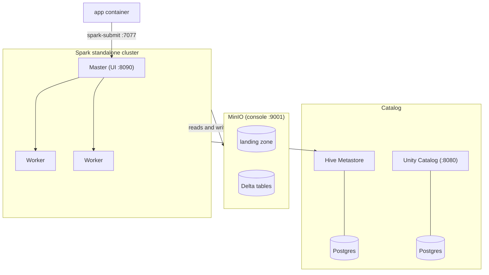

# Architecture

A local lakehouse stack, shaped like a small bank's: object storage, a
relational catalog, and a standalone Spark cluster that jobs are submitted
to. Everything runs from one Compose file, `docker/compose.yaml`, from cold
start.

## Components

| Service | Role | Host port |
|---------|------|-----------|
| `minio` | Object storage: the landing zone for extracts and the location of every Delta table | 9001 (console) |
| `hive-metastore` + `hive-db` | The working catalog. Spark resolves table names here; code never carries paths | |
| `unitycatalog` + `catalog-db` | Runs and holds a namespace, but is not on the read path (see below) | 8080 |
| `spark-master`, 2 workers | Standalone cluster the jobs execute on | 8090 (master UI), 4040 (running job UI) |
| `app` | Submission container. Every `make` target runs `spark-submit --master spark://spark-master:7077` inside it | |

## Job submission path

`make` is the only entry point. A target execs `spark-submit` in the `app`
container against the master; executors on the workers read and write MinIO
directly over `s3a://`, and resolve table metadata through the Hive
Metastore. Application code addresses tables by name (`bronze.party`), never
by path or scheme; `src/lakehouse/catalog.py` is the single place a physical
location is known.

## Why the Hive Metastore, not Unity Catalog

Unity Catalog's credential vending cannot serve a non-AWS S3 endpoint, so
governed access to MinIO-backed tables fails at the vending step. The stack
keeps Unity Catalog running and namespaced so the phase 3 variant is not
foreclosed, and routes the working read path through the Hive Metastore.
The three reproduced failures and the decision record are in
[ADR 0004](adr/0004-spark-session-catalog-until-unity-catalog-can-vend-for-minio.md)
and [ADR 0005](adr/0005-hive-metastore-as-the-working-catalog.md); the
pinned version matrix is
[ADR 0003](adr/0003-version-matrix-for-the-local-lakehouse-stack.md).

## Related

- [Pipeline](pipeline.md): what runs on this stack, layer by layer.
- [Data model](data-model.md): the star schema the pipeline produces.
- [Runbooks](runbooks/): operating the stack, with failure modes from real
  incidents.
