# Data model

The model is declared, not implied. One YAML per entity in
[`model/`](../model/) states the grain as a sentence, the business key, the
history type and sequencing column, tracked attributes, and relationships.
Four artifacts are generated from each spec, so they cannot drift from one
another:

1. The DDL. The grain sentence lands in the table comment, readable from the
   catalog.
2. The integrity tests.
3. The ERD below and the [bus matrix](BUS_MATRIX.md).
4. The transformation contracts: the SCD2 builder reads `history.type` from
   the spec rather than hardcoding it.

A loader refuses to run against a table that has drifted from its spec
(`conformance()` in `src/lakehouse/catalog.py`). The spec schema stays
minimal by rule: it describes only what already varies across existing
entities, and a field used by exactly one spec does not belong in it.

## The star

Generated from the specs by `make docs`; `make check` fails if it drifts.

```mermaid
erDiagram
    fact_account_lifecycle }o--|| dim_account : "account_sk"
    fact_account_lifecycle }o--|| dim_date : "opened_date_key"
    fact_daily_balance }o--|| dim_account : "account_sk"
    fact_daily_balance }o--|| dim_date : "date_key"
    fact_transaction }o--|| dim_party : "party_sk"
    fact_transaction }o--|| dim_account : "account_sk"
    fact_transaction }o--|| dim_merchant_category : "merchant_category_sk"
    fact_transaction }o--|| dim_date : "date_key"
    dim_account {
        string grain "One row per account, carrying its latest known state"
    }
    dim_date {
        string grain "One row per calendar day across the range the facts require"
    }
    dim_merchant_category {
        string grain "One row per merchant category, including a member for transactions that carry none"
    }
    dim_party {
        string grain "One row per party per version of its tracked attributes, effective over a timestamp range"
    }
    fact_account_lifecycle {
        string grain "One row per account, carrying its milestone dates, updated in place as each milestone occurs"
    }
    fact_daily_balance {
        string grain "One row per account per calendar day the account was open, whether or not it transacted"
    }
    fact_transaction {
        string grain "One row per transaction event, resolved to the dimension versions current at the moment it occurred"
    }
```

<!-- erd:start -->

<!-- erd:end -->

## Grain and keys

Grain is a declared choice, not a consequence of the load: the three fact
tables sit at three deliberately different grains (transaction event, account
day, account lifecycle). Surrogate keys are SHA-256 hashes of the business
key, plus the version's `effective_from` for history-keeping entities.
Identity columns depend on insertion order and renumber on rebuild; a hash
gives the same input the same key on any machine, which is what makes a full
rebuild safe and two environments comparable.

`fact_transaction` joins to the party version whose effective range contains
the transaction's event time, not the current version. Why that distinction
is measurable is covered in [SCD Type 2](scd2.md).

## Bus matrix

Business processes against conformed dimensions, generated from the same
specs: [`BUS_MATRIX.md`](BUS_MATRIX.md). A dimension appearing under more
than one process is conformed: built once in silver, reused by every process
that needs it.

## Related

- [Pipeline](pipeline.md): how the layers produce these tables.
- [SCD Type 2](scd2.md): how `dim_party` keeps history.
- [ADR 0009](adr/0009-store-the-daily-balance-snapshot-rather-than-derive-it.md):
  why the daily balance is stored, not derived.
