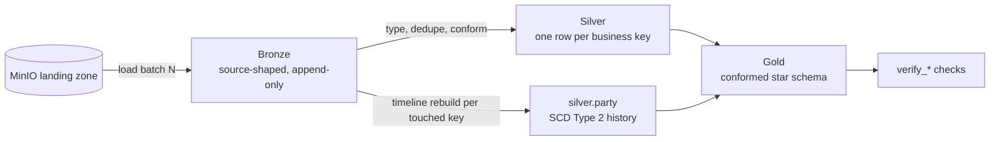

# Pipeline

Batch pipeline from landed extracts to a conformed star schema. Each layer
has one job and refuses the others; the layer boundaries are where the
guarantees change.

## Extract shapes

The three sources are not extracted the same way, and the difference is load
bearing: `party` and `account` arrive as full snapshots per batch, because a
hard delete is only detectable as an absence; `transaction` is an incremental
event stream, because events are facts about a moment and are not restated.
Details in [`data/DEFECTS.md`](../data/DEFECTS.md).

## Layers

**Bronze** lands extracts as they arrived: every column a string, no dedupe,
no coercion, no business logic. A malformed value is kept as evidence of what
the source sent. Three lineage columns are added (`_ingest_ts`,
`_source_file`, `_batch_id`), and unexpected source columns are captured in
`_rescued_data` rather than dropped. Re-running a batch replaces that batch's
rows, so the layer converges instead of growing.

**Silver** is the shared entity layer: typed, deduplicated to one row per
business key, conformed naming driven by the spec. This layer existing once
is what keeps pipeline count proportional to business processes rather than
to consumers; without it, every new request rebuilds entity logic from
bronze. Deduplication is on the
business key plus the sequencing column, not `DISTINCT`, which would collapse
two legitimate same-day versions of a party. Silver performs no dimensional
resolution: transactions keep their natural keys, and resolving them to
dimension versions is gold's job.

**Party history** is maintained as SCD Type 2 in `silver.party`, rebuilt
from bronze for every business key a batch touches so that replaying batches
in any order converges to the same state. The mechanics have their own page:
[SCD Type 2](scd2.md).

**Gold** builds conformed dimensions and facts on silver, never on bronze.
Surrogate keys are hashes of the business key (plus `effective_from` where
the entity keeps history), so a full rebuild reproduces identical keys.
Facts resolve to the dimension version current at event time, and references
to not-yet-arrived dimension members become flagged inferred members,
reconciled when the real record lands. The tables and grains are on the
[data model](data-model.md) page.

## Batch execution

`make demo` runs the layers one batch at a time; each `make run-*` target is
a `spark-submit` of the matching `scripts/run_*.py`. There is no scheduler
and no config framework by design; batch order and cadence are explicit in
the `Makefile`.

## Verification

Correctness is scripted, not asserted:

- `make check`: docs integrity, lint, unit tests.
- `make test-spark`: transformation tests, run inside the container.
- `scripts/verify_bronze.py` through `verify_gold.py`: SCD2 range integrity,
  grain uniqueness, orphan keys, balance continuity, milestone ordering.

The generated data carries eight seeded defects
([`data/DEFECTS.md`](../data/DEFECTS.md)), each with a test asserting it is
still planted. Every layer guarantee above is exercised by at least one of
them.

## Related

- [Architecture](architecture.md): the stack this runs on.
- [Data model](data-model.md): specs, star schema, bus matrix.
- [SCD Type 2](scd2.md): party history mechanics.
