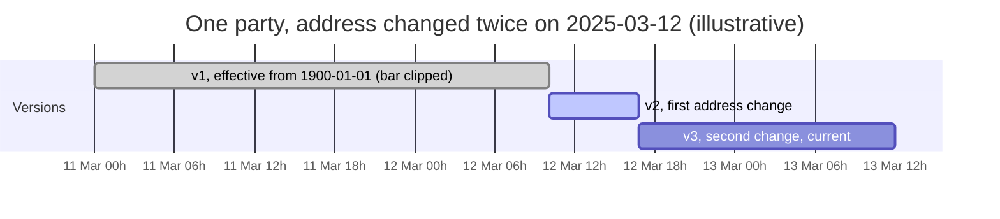

# SCD Type 2

Party history is kept in `silver.party` as SCD Type 2: one row per business
key per version of its tracked attributes, effective over a timestamp range.
This page covers the range semantics, the rebuild strategy, and what
event-time resolution measurably changes.

## Ranges are timestamp-grained and half open

A version is effective over `[effective_from, effective_to)`. The current
version carries `effective_to = 9999-12-31 23:59:59` and `is_current = true`.
Ranges are timestamp-grained because the source can change an entity twice in
one day; a date-grained range either loses one of the versions or produces a
zero-length range.

Every timestamp belongs to exactly one version: a transaction at 10:02
resolves to v2, one at 16:44 also to v2, one at 16:45 to v3. The first
version of any key starts at the beginning of time, not at its first
`updated_at`, so early transactions still resolve
([ADR 0008](adr/0008-the-first-version-of-a-dimension-starts-at-the-beginning-of-time.md)).

## The timeline is rebuilt, not appended to

Versions are sequenced by the source's `updated_at`, not by arrival order. A
record can arrive carrying state older than a version already loaded, and
inserting it means rewriting the effective range on both sides, which MERGE
cannot do in one pass. So for every business key a batch touches, the whole
timeline is rebuilt from bronze, which holds every version ever landed.
Rebuilding from the stored table instead made convergence order-lucky, since
the stored table holds only rebuild survivors; the incident and the fix are
in [ADR 0011](adr/0011-the-scd2-rebuild-reads-bronze-not-the-stored-table.md).
The property this buys: replaying batches in any order converges to the same
final state.

## Deletion is derived, not received

The party extract is a full snapshot per batch, so a hard delete is
detectable only as an absence. A vanished key closes its timeline
([ADR 0007](adr/0007-a-vanished-party-closes-its-timeline.md)); the deletion
signal derives from the snapshot stream itself, after a replay-order defect
silently resurrected 25 deleted parties past a green convergence proof
([ADR 0010](adr/0010-deletion-derives-from-the-snapshot-stream.md), written
up in [review-06](audits/2026-08-09-review-06/00-executive-summary.md)).

## Why event-time resolution matters

`fact_transaction` joins each transaction to the party version whose range
contains the transaction's event time. In the generated data, 14,899
transactions belong to a party whose tracked attributes changed, and 13,247
of them resolve to a version that is not the current one. A join to
`is_current` answers all 13,247 differently, and the join still succeeds, so
nothing flags the error. `scripts/verify_scd2.py` checks range integrity
(no gaps, no overlaps, one current row per undeleted key); it is a manual
`spark-submit` step, run per the
[runbook](runbooks/run-the-lakehouse-stack.md), not invoked by `make` or CI.

## Related

- [Pipeline](pipeline.md): where the SCD2 build sits in the batch flow.
- [Data model](data-model.md): how `dim_party` derives surrogate keys from
  these versions.
- [`data/DEFECTS.md`](../data/DEFECTS.md): the four seeded defects aimed at
  this module.
